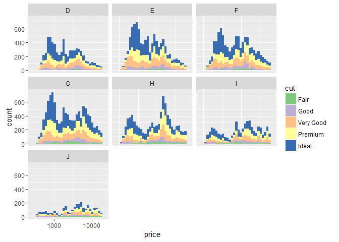
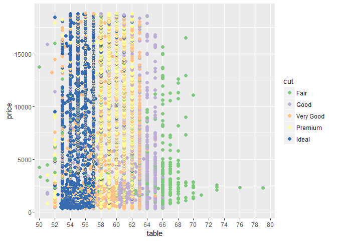
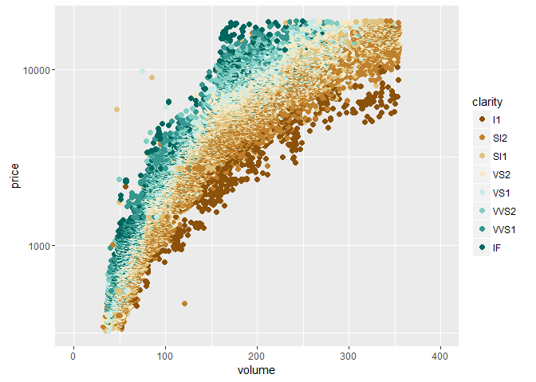
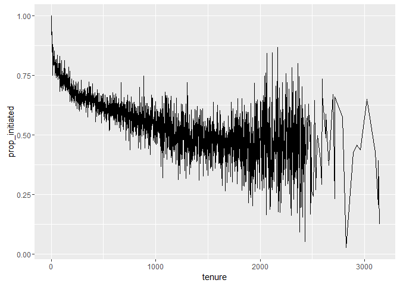
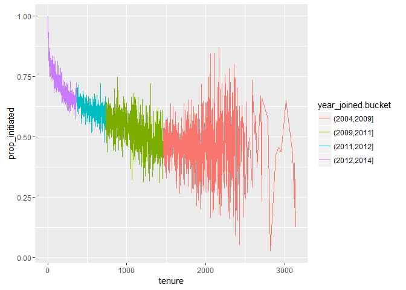
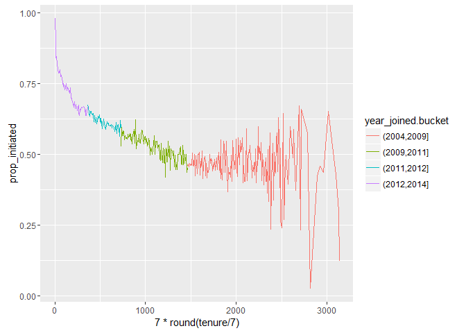
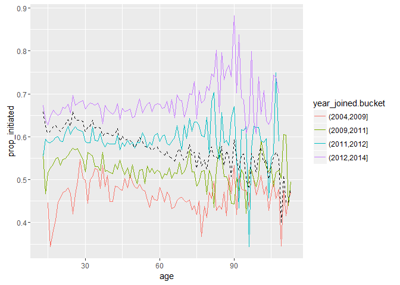
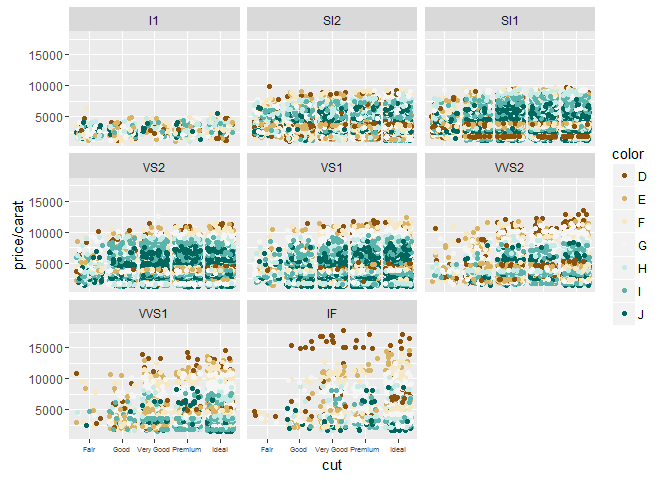

# Diamond Prices EDA Problem Set 5
Manu Kushwaha  
May 19, 2016  


```r
# Loading the required libraries
library(ggplot2)
suppressMessages(library(dplyr))
suppressMessages(library(gridExtra))
```


```r
# Loading the diamonds dataset into "d" and creating the scatterplot
d <- diamonds
```

### Q1) Price Histograms with Facet and Color
* Create a histogram of diamond prices. Facet the histogram by diamond color and use cut to color the histogram bars. 
* Note: In the link, a color palette of type 'qual' was used to color the histogram using scale_fill_brewer(type = 'qual').
* The plot should look something like this: http://i.imgur.com/b5xyrOu.jpg


```r
ggplot(aes(x = price, fill = cut), data = d) + 
  geom_histogram() + 
  facet_wrap(~color) +
  scale_fill_brewer(type = 'qual') +
  scale_x_log10()
```

```
## `stat_bin()` using `bins = 30`. Pick better value with `binwidth`.
```

\

***

### Q2) Price vs. Table Colored by Cut
* Create a scatterplot of diamond price vs. table and color the points by the cut of the diamond.
* The plot should look something like this: http://i.imgur.com/rQF9jQr.jpg
* Note: In the link, a color palette of type 'qual' was used to color the scatterplot using scale_color_brewer(type = 'qual').


```r
ggplot(aes(x = table, y = price), data = d) +
  geom_point(aes(color = cut), size = 2) +
  scale_colour_brewer(type = "qual") +
  coord_cartesian(xlim = c(50, 80)) +
  scale_x_discrete(breaks = seq(50, 80, 2))
```

\


***

### Q3) Typical Table Value
##### Use the graph that you created from the previous exercise to see the answer. You do not need to run summaries.

#### What is the typical table range for the majority of the diamonds of ideal cut?
* The table range is between 53 and 57

#### What is the typical table range for the majority of the diamonds of premium cut?
* The table range is between 58 and 62

***

### Q4) Price vs. Volume and Diamond Clarity
* Create a scatterplot of diamond price vs. volume (x * y * z) and color the points by the clarity of diamonds.
* Use scale on the y-axis to take the log10 of price.
* You should also omit the top 1% of diamond volumes from the plot.
* Note: Volume is a very rough approximation of a diamond's actual volume.
* The plot should look something like this: http://i.imgur.com/excUpea.jpg
* Note: In the link, a color palette of type 'div' was used to color the scatterplot using scale_color_brewer(type = 'div')


```r
# First creating a volume variable in the diamonds dataset
d$volume <- with(d, x * y * z)

# Creating the scatterplot
ggplot(aes(x = volume, y = price), 
       data = subset(d, volume < quantile(volume, probs = 0.99) & volume > 0)) +
  geom_point(aes(color = clarity), size = 2) +
  scale_colour_brewer(type = "div") +
  coord_cartesian(xlim = c(0, 400)) +
  scale_y_log10()
```

\

***

### Q5) Proportion of Friendships Initiated
* Many interesting variables are derived from two or more others.For example, we might wonder how much of a person's network on a service like Facebook the user actively initiated. Two users with the same degree (or number of friends) might be very different if one initiated most of those connections on the service, while the other initiated very few. So it could be useful to consider this proportion of existing friendships that the user initiated. This might be a good predictor of how active a user is compared with their peers, or other traits, such as personality (i.e., is this person an extrovert?).

* Your task is to create a new variable called 'prop_initiated' in the Pseudo-Facebook data set.
* The variable should contain the proportion of friendships that the user initiated.


```r
# Reading in the pseudo facebook file
pf <- read.delim('pseudo_facebook.tsv')

# Creating the prop_initiated variable in the pf dataset
pf$prop_initiated <- with(pf, friendships_initiated / friend_count)
```

***

### Q6) Smoothing prop_initiated vs. tenure

* Smooth the last plot you created of prop_initiated vs tenure colored by year_joined.bucket.
* You can bin together ranges of tenure or add a smoother to the plot.


```r
# Add year joined to the dataframe
pf$year_joined = floor(2014 - pf$tenure / 365)

# Add year joined bucket using cut to bin year ranges
pf$year_joined.bucket = cut(pf$year_joined,c(2004,2009,2011,2012,2014))

# Plot ine graph with median of y
ggplot(aes(x = tenure, y = prop_initiated ), data = pf) +
  geom_line(stat = 'summary', fun.y = median)
```

```
## Warning: Removed 1964 rows containing non-finite values (stat_summary).
```

\

```r
# Color by year_joined.bucket
ggplot(aes(x = tenure, y = prop_initiated ), data = pf) +
  geom_line(aes(color = year_joined.bucket),
            stat = 'summary', fun.y = median)
```

```
## Warning: Removed 1964 rows containing non-finite values (stat_summary).
```

\

```r
# Smooth plot by increasing bin width
ggplot(aes(x = 7 * round(tenure / 7), y = prop_initiated ),
       data = subset(pf, tenure > 0)) +
  geom_line(aes(color = year_joined.bucket),
            stat = 'summary', fun.y = median)
```

```
## Warning: Removed 1897 rows containing non-finite values (stat_summary).
```

\


***

### Q7) Greatest prop_initiated Group
#### On average, which group initiated the greatest proportion of its Facebook friendships?
* The plot with the smoother that you created in the last exercise can help you answer the question.
* Answer: People who joined after 2012 as shown by the purple line in the graph

***

### Q8)  Largest Group Mean prop_initiated
#### a) For the group with the largest porportion of friendships initiated, what is the group's average(mean) proportion of friendships initiated?


```r
with(subset(pf, year_joined > 2012 & year_joined <= 2014), summary(prop_initiated))
```

```
##    Min. 1st Qu.  Median    Mean 3rd Qu.    Max.    NA's 
##  0.0000  0.5115  0.7018  0.6654  0.8490  1.0000    1468
```

* Answer: 0.6654

#### b) Why do you think this group's proportion of friendships initiated is higher than others?


```r
ggplot(aes(x = age, y = prop_initiated),
       data = subset(pf, !is.na(year_joined.bucket))) +
  geom_line(aes(color = year_joined.bucket),
            stat = "summary", 
            fun.y = mean) +
  geom_line(stat = "summary", fun.y = mean, linetype = 2)
```

```
## Warning: Removed 1962 rows containing non-finite values (stat_summary).

## Warning: Removed 1962 rows containing non-finite values (stat_summary).
```

\

* Answer: It appears that majority of the active users are below 30 years of age. As smartphones become more utilized and consumers become more connected, the younger generation is more receptive and active in picking up technology and implementing it.

***

### Q9) Price/Carat Binned, Faceted, & Colored
* Create a scatter plot of the price/carat ratio of diamonds 
* The variable x should be assigned to cut
* The points should be colored by diamond color, and the plot should be faceted by clarity
* The plot should look something like this: http://i.imgur.com/YzbWkHT.jpg
* Note: In the link, a color palette of type 'div' was used to color the histogram using scale_color_brewer(type = 'div')


```r
ggplot(aes(x = cut, y = price / carat), data = d) +
  geom_jitter(aes(color = color)) +
  facet_wrap( ~ clarity) +
  scale_colour_brewer(type = "div") +
  theme(axis.text.x = element_text(size = 5))
```

\
